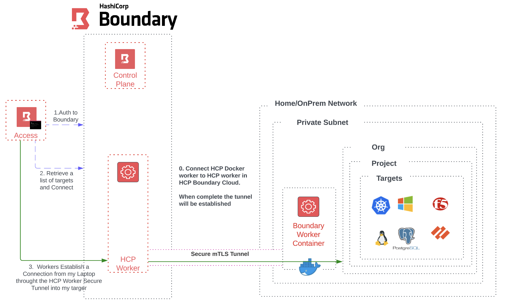

# Setup Hashicorp HCP Boundary Docker

With the new release of HCP 0.12 
https://www.hashicorp.com/blog/boundary-0-12-introduces-multi-hop-sessions-and-ssh-certificate-injection



## Steps Build Boundary Docker Worker
Create a root folder for your HCP Boundary Docker, inside that folder create the following docker-compose.yml and volume file structure.


## Step 1
Create an HCP Boundary Cloud Account

1. Once HCP Boundary has been deployed, log into the Admin Portal and click on WORKERS, grab one of the IP address from one of the 3 workers deployed
2. Create the configuration file and input that IP Address/FQDN:9202 

```
cat > config/boundary/config/config.hcl << EOF
disable_mlock = true

listener "tcp" {
  address = "0.0.0.0:9203"
  purpose = "proxy"
}

worker {
  initial_upstreams = ["777777-4dd4-20df-521c-54ae2f867e71.proxy.boundary.hashicorp.cloud:9202"]
  auth_storage_path = "/boundary-hcp-worker/file/worker2"
  tags {
    type = ["worker3", "homelab"]
  }
}

EOF
```
## Step 2

1. Start your environment.
 
```
docker compose up -d
```

2. When the docker is online, grab the worker token.


3. Next, in your CLI export the token

```
export WORKER_TOKEN=<insert>
```

4. Log into boundary using the cli, set an export for boundary_addr to your own HCP.

```
export BOUNDARY_ADDR=<insert>
```

5. Authenticate to boundary with your admin username and password

```
boundary authenticate 
```

6. Execute the following command to create a boundary worker in HCP Boundary

```
boundary workers create worker-led -worker-generated-auth-token=$WORKER_TOKEN
```

Now if you log into your HCP Boundary Worker section you will see ur worker get created.

## Deploy the Setup Script
Since we are deploying this locally on your machine or pc we will need your IP address. So for now edit the deploy.sh and add your IP address of your machine. 

1. Edit the deploy.sh export HOSTIP=<insert your pc ip>
2. ``` chmod +x ./deploy.sh ```
3. Execute the command to do the configuraiton.

```
./deploy.sh
```


# Test it out 
```
export BOUNDARY_ADDR=<insert>
boundary authenticate 
```

Execute SSH injection command

```
boundary connect ssh -target-name="Linux" -target-scope-name="Docker Servers"
```

