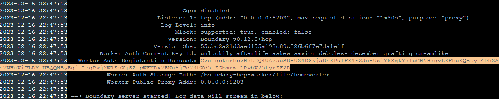

# Setup Hashicorp HCP Boundary Docker

With the new release of HCP 0.12 
https://www.hashicorp.com/blog/boundary-0-12-introduces-multi-hop-sessions-and-ssh-certificate-injection


## Steps Build Boundary Docker Worker
Create a root folder for your HCP Boundary Docker, inside that folder create the following docker-compose.yml and volume file structure.


```
touch docker-compose.yml
mkdir -p volume/{config,file,logs}
```

Populate the boundary hcp config config.hcl. You will need to log into your HCP Boundary cluster and select one of the 3 HCP workers that deployed. Take the HCP Boundary Worker 

```
cat > volumes/config/config.hcl << EOF
disable_mlock = true

listener "tcp" {
  address = "0.0.0.0:9203"
  purpose = "proxy"
}

worker {
  initial_upstreams = ["asdfasdfasdfasdf.proxy.boundary.hashicorp.cloud:9202"]
  auth_storage_path = "/boundary-hcp-worker/file/worker2"
  tags {
    type = ["worker2", "downstream"]
  }
}

EOF
```

Populate the docker-compose.yml:

```
cat > docker-compose.yml << EOF
version: '2'
services:
  boundary-hcp-worker:
    image: hashicorp/boundary-worker-hcp
    container_name: boundary-hcp-worker
    ports:
      - "9203:9203"
      - "9202:9202"
    restart: always
    volumes:
      - ./volume/config:/boundary-hcp-worker/config
      - ./volume/logs:/boundary-hcp-worker/logs
      - ./volume/file:/boundary-hcp-worker/file
    cap_add:
      - IPC_LOCK
    entrypoint: boundary-worker server -config=/boundary-hcp-worker/config/config.hcl
EOF
```

Start your Docker

```
docker compose up -d
```


When the docker is online, grab the worker token.



Next, in your CLI export the token

```
export WORKER_TOKEN=GzusqckarbczHoLaRhKPufF84F2JsSUxiYkXgkY71uGHNH7qvLKFbuKQBty14DhXAiccjc8ACuxLkMMzCMr1uCsjh5f9CH
```

log into boundary using the cli, set an export for boundary_addr to your own HCP.

```
export BOUNDARY_ADDR=c56-6e5ee57a1aec.boundary.hashicorp.cloud
```

Authenticate to boundary with your admin username and password

```
boundary authenticate 
```

Execute the following command to create a boundary worker in HCP Boundary

```
boundary workers create worker-led -worker-generated-auth-token=$WORKER_TOKEN
```


